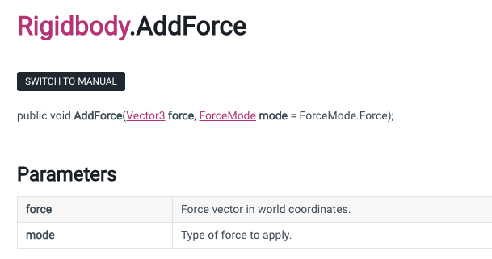

The first script action we get to do is change the size of an asset by accessing its transform properties through code instead of the Unity GUI.

### Quadruple width and height

We will be accessing the `Transform class`, one of which properties is a `localScale` variable. Start by saving a copy of that to get an initial set of values, which turns out are a `Vector3` type, since that is the data type I have to declare when I create my variable to be the copy.

```c#
// by declaring a variable it creates a new address in memory of that data type and copies the values over
Vector3 newScale = transform.localScale;
```

Next, we can simply quadruple whatever the original values are with nice shorthand to take the value using `dot notation`, multiply it, and save the value back again:

```c#
newScale.x *= 4;
newScale.y *= 4;
```

Finally, those new values can be given back to the localScale like so:

```c#
// Dr T doesn't explain it, but fairly certain we then 'point' the localScale at this new set of values once they are set
transform.localScale = newScale;
```

### 2D Physics

The same way that we accessed a `transform` component to change the rendered scale of an image asset, we can add other components and access their properties as well. Unsurprisingly, the component to add to objects in order to allow them to have a set of governing set of physics (rules about interactions between objects) is called `Physics 2D`. Just as in the real world, objects can be rigid or soft, but for now the choice will be `rigid body 2D`. Dr T. notes that he often re-orders the components in the GUI so that scripts appear at the bottom of the list.

If we were to attach a Physics 2D engine to an object we had positioned in the middle of the screen, when we press `Play`, that object will simply fall and disappear off the bottom edge of the screen. This should make some sense, gravity is added by default to all physical objects, and we have yet to add a floor to our scene.

For now, we can edit the Physics 2D settings. BY going to Edit > Project settings, we can select the `Physics 2D` engine. This will open up a control panel on your screen. We can see in the inspector that our gravity is currently set to have 0 pull in the X direction and -9.81 in the Y direction. I know from my college coursework that gravity is 9.81m/s^2, so this tells me that the physics engine is computing in meters per second squared, should I need a reference for adjusting it. However, for now, let's just put it to 0, and our asset can now float free in space.

Once we click run, the object will simply sit there, since there are no forces acting on it.

### Add a force to an object

If we go to the documentation for the `Rigidbody2D` component, there is a long list of functions/methods available. At the very top is one called `AddForce`, which simply applies a force to the given rigid body.



Here we can see that it is a `void` method, which means it returns no values. It can take two parameters, a `force`, and an optional `mode`. The way the docs indicate that something is optional is by the `= ForceMode.force` that follows mode. It indicates that if there is no value provided, it will automatically be assigned a standard force mode.

For fun, I looked up the modes and found 4 types - Acceleration, Force, Impulse and Velocity Change. Already I feel that they could have chosen `Constant` instead of the word `Force` to mean a steadily applied force, but that can be inferred by looking at the other 3 options. Dr. Ts version is so old it actually only offers Force and Impulse, and not the other two complex methods.

First, we create an instance of the `Rigidbody2D` class so that we can copy over the values from the rigid body 2d component `instance` that we added to our game object. To get that component is a slightly different method call.

```c#
Rigidbody2D rb = GetComponent<Rigidbody2D>();
```

Next, we can use the `AddForce` method that we learned about to add a force to our game object. Remembering from before, it needs at the minimum the force, which in this case is a Vector2 data type for x and y movement. We can create a new one on the fly and it's value will be created and passed to the AddForce method. We can also add the optional force mode by passing in one of the four available forces.

```c#
rb.AddForce(new Vector@(1,0), ForceMode2D.Impulse);
```

Once it is saved, you still need to attach the mover script to the object in the game. Once you press play, you should see the object move off to the right and keep going.

An optional way of accessing and updating the rigidbody component of the object the script is attached to can be done in a single line instead of the two above.

```c#
GetComponent<Rigidbody2D>().AddForce(new Vector@(1,0), ForceMode2D.Impulse);
```
