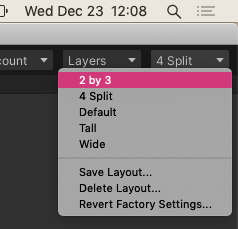
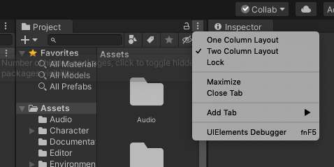

Week 1 Task 1 - Set up VS Community 2019 and Unity Hub

After finding the tiny "Audit for free" link hidden in plain sight at the bottom of the page of the coursera page, I was taken to the course overview. Skipping the intro videos by skimming the available transcription (I read about twice the speed that most people can talk), I then got to links for a free PDF version of the recommended textbook. This is very appreciated as I find the textbook publishing industry to be rather deplorable and in need of some thoughtful reform.

### Install Visual Studio Community

The pdf points to [Visual Studio by Microsoft](https://visualstudio.microsoft.com/), and I chose the variant available for Mac, hoping it will fit on the few gigs left available to me on my 2017 Macbook Pro.

After opening the installer program, I chose the .NET, Android and iOS packages, leaving off the tools to port apps to MacOS (Cocoa). Since that 2.5Gb download is taking a while I'm gonna go get in a workout.

### Verify install

Part of the syllabus instructions are to use the templating system to create a new `Console App` with .NET/C#. Once it has been created and saved to the directory of chioce, use the build command to build the `Solution` which seems to be a fancy name for project or workspace.

Once it has built successfully, run the application with CMD+ENTER or click run from the Run menu.

Additionally, Dr. T who has created the course I am taking asks to ensure the help documentation is there. Unlike with windows machines, the help is already linked in the app with no additional downloads seeming necessary.

### Install Unity Hub

Next up is installing the [Unity Hub](https://store.unity.com/#plans-individual), and making sure to select and affirm that you are able to use a free plan. Once downloaded and added to apps, open Unity Hub to create a login (supposedly optional but I didn't find any hidden 'work offline' button to click). Once you are in and everything fully installed, create a sample 2D app to ensure Unity can build correctly.

### Set Up Workspace

Next, Dr. T asks to choose the 2x3 Layout. After much searching, I found it under the Window menu up top, and also at the very top right of the application window.

Also, choose the one column layout for project files, in the middle.

